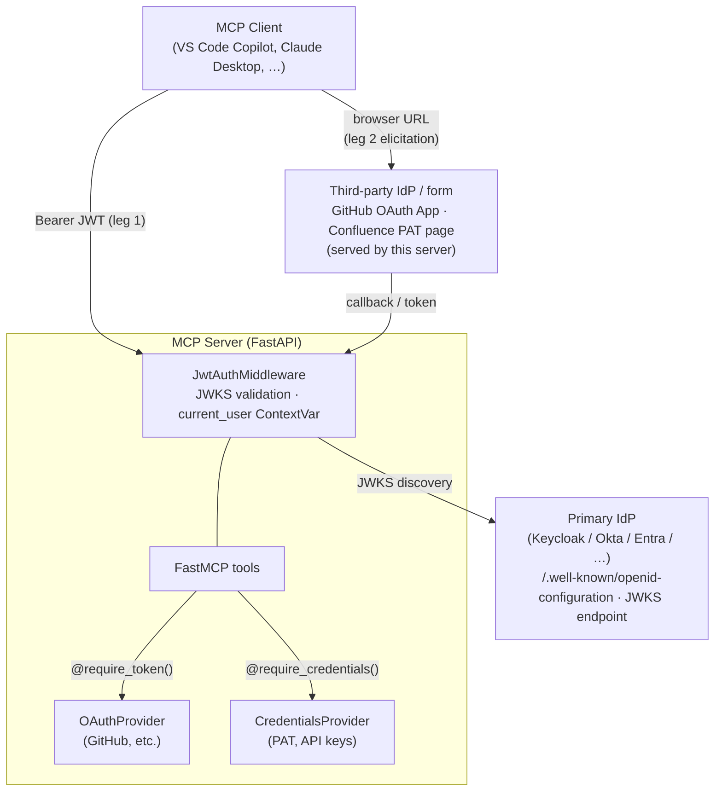
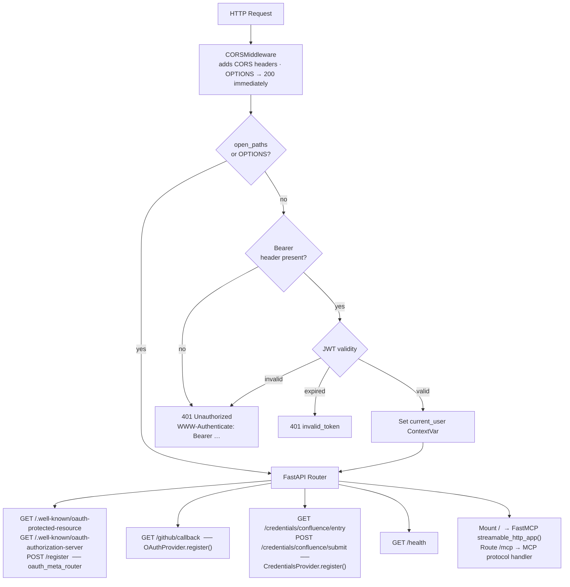
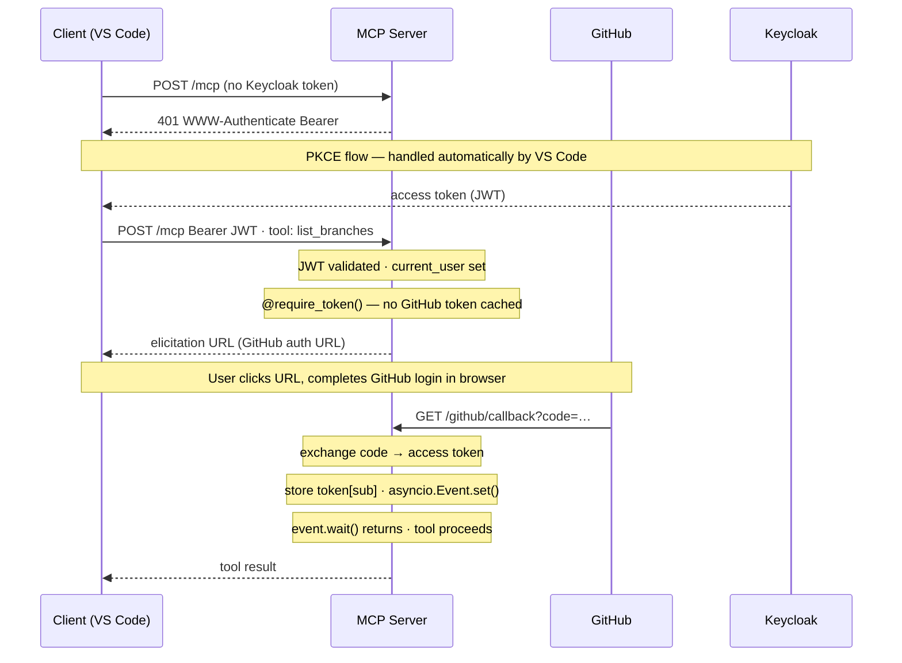
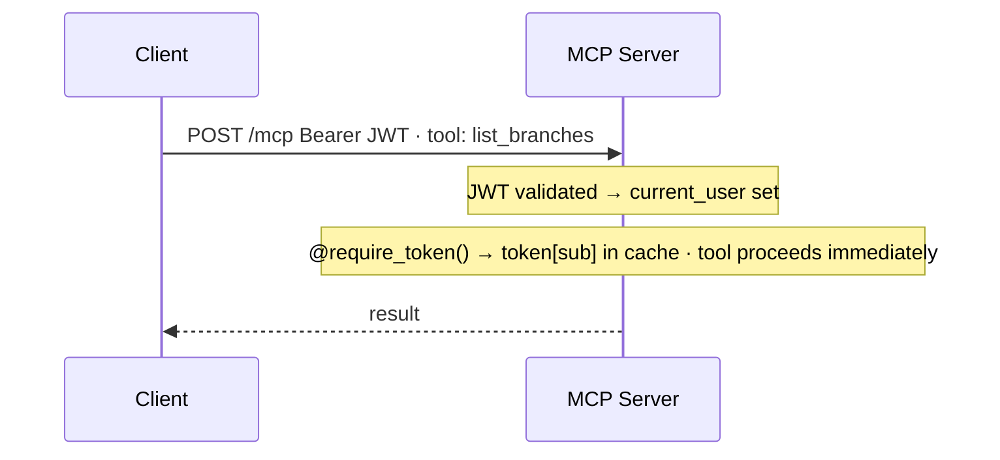

# Architecture & Strategy

## Problem statement

A FastMCP server needs to answer two distinct questions for every tool invocation:

1. **Who is calling?** — the MCP *client* (VS Code, Claude Desktop, …) must prove it is acting on behalf of a real authenticated user before it can even open a session.
2. **Can this tool proceed?** — some tools need a *separate* credential (a GitHub token, a Confluence PAT, …) that the primary auth system does not supply. That credential must be collected without storing secrets in the LLM context.

These are addressed by two independent authentication legs that coexist in the same FastAPI/FastMCP process.

---

## Two-leg authentication strategy

### Leg 1 — Session-level OIDC JWT

Every HTTP request must carry `Authorization: Bearer <token>`. The token is a signed JWT issued by the primary OIDC provider (Keycloak in the reference setup). The server:

- Discovers `jwks_uri` via `{issuer_url}/.well-known/openid-configuration` (cached 10 min).
- Validates the signature against the JWKS (cached 10 min).
- Extracts `sub`, `preferred_username`, `email`, `name`, `iss`, `exp` into a `ContextVar[dict]` (`current_user`) that any tool can read.

The MCP client (VS Code) handles the PKCE flow automatically once it receives the `401 Unauthorized` with the correct `WWW-Authenticate` header pointing to the resource metadata URL.

**The server never sees or stores the primary access token** — it only validates signatures.

### Leg 2 — Tool-level elicitation

Individual tools that need a secondary credential apply a decorator (`@require_token()` or `@require_credentials()`). On first invocation for a given user:

1. The decorator checks the in-memory token/credentials store (keyed by the primary OIDC `sub`).
2. If nothing is cached, it calls `ctx.elicit_url(url)` (MCP spec §3.3 URL mode) to send a URL to the client.
3. The client opens the URL in the user's browser.
4. After the user completes the flow (OAuth callback or form submission), the server sends `notifications/elicitation/complete` (§3.4) via `asyncio.Event`, unblocking the tool.
5. The tool proceeds with the now-cached credential.

On subsequent invocations the decorator returns immediately with the cached value — no browser interaction.

---

## Request lifecycle

---

## MCP OAuth spec compliance (2025-11-25)

The server acts as both an **OAuth protected resource** and an **authorization server proxy**.

| Spec requirement | Implementation |
|---|---|
| `WWW-Authenticate: Bearer` with `resource_metadata` on 401 | `JwtAuthMiddleware._unauthorized()` |
| RFC 9728 — OAuth Protected Resource Metadata | `GET /.well-known/oauth-protected-resource` |
| RFC 8414 — Authorization Server Metadata | `GET /.well-known/oauth-authorization-server` (proxied + re-issued under server base URL) |
| Dynamic Client Registration (RFC 7591) | `POST /register` DCR façade — always returns a pre-registered public client ID |
| URL mode elicitation (§3.3) | `ctx.elicit_url(url)` in both providers |
| `notifications/elicitation/complete` (§3.4) | `ctx.session.send_elicit_complete(elicitation_id)` |
| `UrlElicitationRequiredError` -32042 (§3.5) | Raised by both providers in `fail_fast=True` mode |

### Why a DCR façade instead of real DCR?

The primary OIDC provider (Keycloak) supports a fixed set of pre-registered clients. Rather than implementing dynamic registration on the IdP (which would require admin APIs and persistent storage), the DCR endpoint simply returns the pre-registered public client ID every time. The MCP client (VS Code) is satisfied — it gets back a `client_id` it can use for PKCE — and the actual authorization happens at Keycloak with the real client configuration.

### Why proxy the authorization server metadata?

The MCP spec requires the authorization server metadata (auth endpoint, token endpoint, JWKS) to be served at `{server_base_url}/.well-known/oauth-authorization-server`. The actual endpoints live at the IdP. The server fetches the IdP's OIDC discovery document and re-publishes the real endpoints under its own well-known URL, with `issuer` set to the server base URL and `registration_endpoint` pointing to the local DCR façade.

---

## Component design

### `JwtAuthMiddleware` (`lib/auth_middleware.py`)

A `BaseHTTPMiddleware` subclass registered via `app.add_middleware(JwtAuthMiddleware, ...)`. Chosen over `@app.middleware("http")` to enable clean parameterisation and reuse across servers.

The `current_user` `ContextVar` is passed in at construction time so the middleware does not depend on any global state. Tools read it directly — no FastAPI dependency injection needed inside MCP tools (which don't use `Depends`).

### `OAuthProvider` (`lib/providers/oauth_provider.py`)

Holds a backing token store and an in-flight pending store, both resolved lazily on first use via `create_stores(namespace=name)`. The provider's `name` (e.g. `"github"`) is automatically used as the namespace, so its data is always isolated from other providers regardless of the storage backend.

Each pending entry carries an `asyncio.Event`; the callback route sets it and the decorator awaits it. This avoids polling and works naturally with asyncio's single-threaded event loop.

Token data is normalised at storage time: bare `str` results (access token only) and `dict` results (with optional `refresh_token`, `expires_in`) are both stored as a uniform `TokenData` dict.

The `from_standard_oauth2` factory covers the common case (Authorization Code + token exchange). For providers with non-standard flows, `OAuthProvider` can be instantiated directly with custom `build_auth_url` and `exchange_code` callables.

### `CredentialsProvider` (`lib/providers/credentials_provider.py`)

Serves an HTML form generated from the `variables` dict. Each field maps to an `<input type="…">` element; `"password"` fields use `type="password"` so the browser masks them. An optional Markdown how-to guide is rendered above the form client-side by `marked.js` (no server-side markdown processing required).

Like `OAuthProvider`, the backing stores are resolved lazily on first use with `create_stores(namespace=name)`, keeping credential namespaces fully isolated from OAuth token namespaces. The entry token is a `secrets.token_urlsafe(16)` stored in the pending store with an expiry timestamp; it is consumed on submit, preventing replay.

### `oauth_meta_router` (`lib/auth_routes.py`)

Returns an `APIRouter` (not a function that mutates `app`). Registered via `app.include_router(...)` for idiomatic FastAPI integration. The router must be included *before* `app.mount("/", mcp_app)` so its routes take precedence over the catch-all mount.

### FastMCP mount ordering

FastAPI/Starlette matches routes in registration order. `app.mount("/", mcp_app)` adds a `Mount` object that matches every path — it must therefore be the **last** route added. The MCP sub-app's internal Starlette router exposes a single route at `/mcp`; when mounted at `/`, a request for `POST /mcp` is forwarded to the sub-app with path `/mcp`, which matches correctly.

---

## Token & credential storage

### Store subsystem (`lib/store/`)

All token and credential state is managed through a common interface (`TokenStore`, `PendingStore` in `lib/store/base.py`). Three backends are available, selected at startup via the `TOKEN_STORAGE_MODE` environment variable:

| Mode | Class | Use case |
|---|---|---|
| `memory` (default) | `MemoryTokenStore` / `MemoryPendingStore` | Development / single-process |
| `file` | `FileTokenStore` / `FilePendingStore` | Single-host multi-worker (shared filesystem) |
| `redis` | `RedisTokenStore` / `RedisPendingStore` | Distributed / cloud deployments |

The factory (`lib/store/factory.py`) reads the relevant env vars and returns the appropriate `(token_store, pending_store)` pair. Providers call `create_stores(namespace=name)` lazily on first use — `server.py` has no knowledge of stores or storage configuration.

### Namespace isolation

Every provider passes its `name` as a namespace when creating stores. This prevents two providers that share the same OIDC `sub` from colliding:

- **File mode**: data lands in `{FILE_STORAGE_PATH}/tokens/{namespace}/` and `{FILE_STORAGE_PATH}/pending/{namespace}/`
- **Redis mode**: namespace is embedded in the key prefix — `{prefix}{namespace}:token:{hash}`, `{prefix}{namespace}:pending:{hash}`
- **Memory mode**: each provider holds its own dict instance — no shared state

### Encryption at rest

File and Redis backends encrypt every value with [Fernet](https://cryptography.io/en/latest/fernet/) (AES-128-CBC + HMAC-SHA256) before writing. The key is resolved at startup in this order:

1. `STORAGE_ENCRYPTION_KEY` env var — base64-encoded Fernet key
2. `STORAGE_ENCRYPTION_KEY_PATH` env var — path to a file containing the key (suitable for Docker secrets, AWS Secrets Manager, Vault agent templates, etc.)

If neither is set the server raises a `RuntimeError` at startup rather than silently generating an ephemeral key.

### Sub hashing

Neither the file store nor the Redis store writes the raw OIDC `sub` value to disk or to Redis. Both compute `sha256(sub)` and use the hex digest as the storage key:

- **File**: filename is `{sha256(sub).hexdigest()}.enc`
- **Redis**: key suffix is `token:{sha256(sub).hexdigest()}`

This means a compromised storage layer reveals no usernames or subject identifiers — only opaque hashes and Fernet-encrypted blobs.

### Multi-process and persistence characteristics

| Mode | Survives restart | Multi-worker safe | Distributed |
|---|---|---|---|
| `memory` | ✗ | ✗ (per-worker dict) | ✗ |
| `file` | ✓ | ✓ (atomic rename writes) | ✓ (shared NFS/EFS) |
| `redis` | ✓ | ✓ | ✓ |

Expiry is checked lazily on every `require_token()` / `require_credentials()` call — there is no background sweep. Expired entries remain in the store until the user's next request triggers a re-elicitation.

---

## SSL / TLS note (Python 3.14)

Python 3.14 enables `VERIFY_X509_STRICT` by default, which rejects certificates that violate RFC 5280 strictly. This breaks some enterprise CAs (e.g. Netskope). The server creates a custom `ssl.SSLContext` at startup that disables that flag and passes it as `verify=` to all `httpx` calls. This is intentional and scoped to the server process only.

---

## Sequence diagrams

### First tool call — OAuth secondary leg

### Subsequent tool calls

