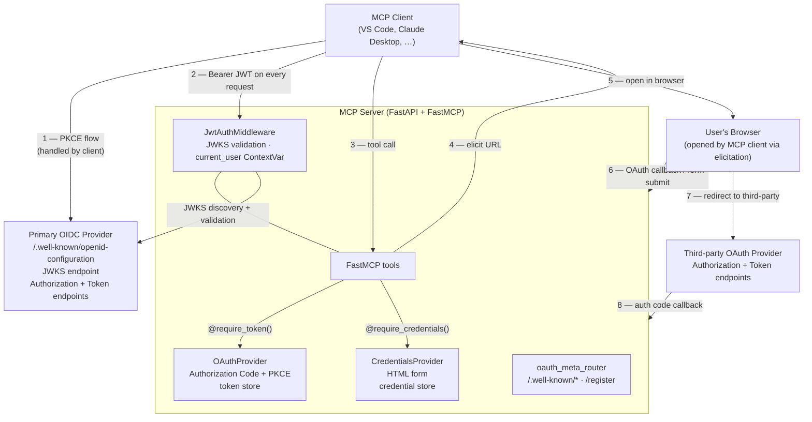
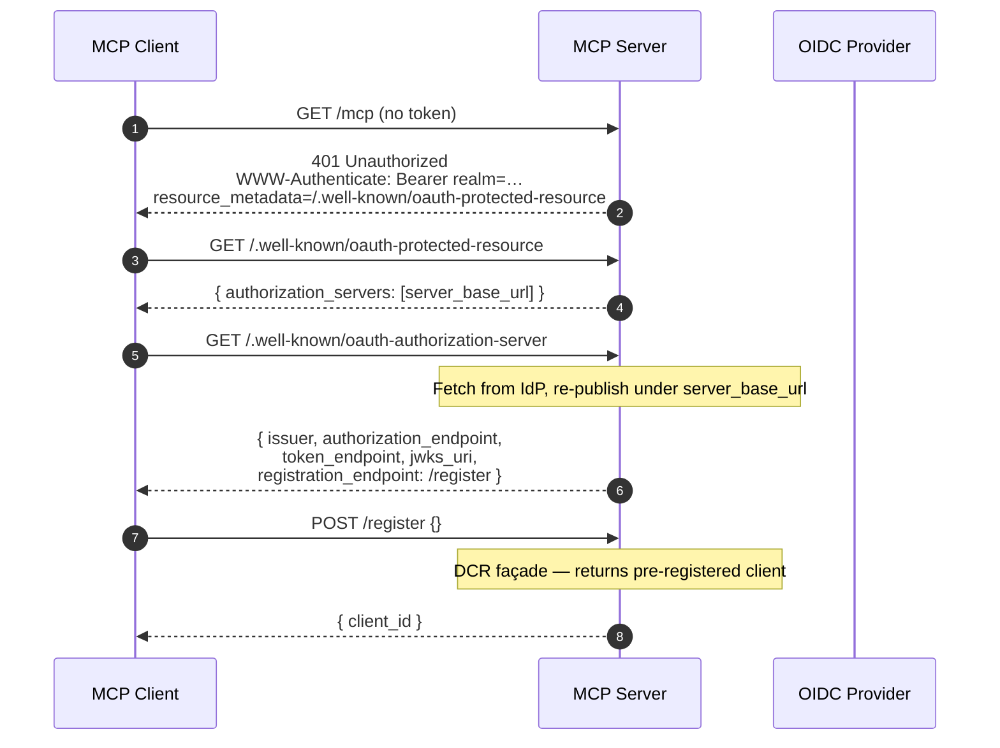
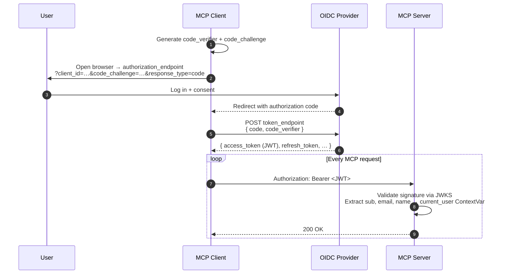
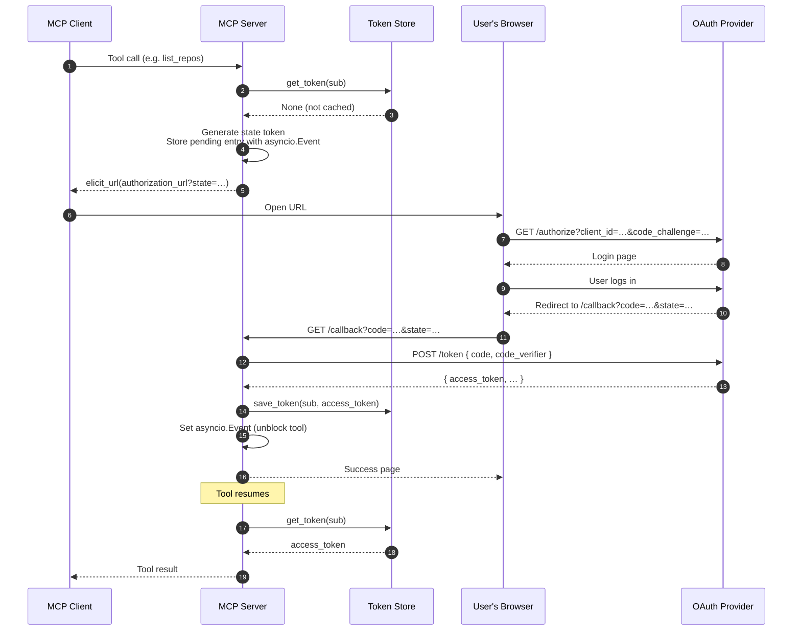
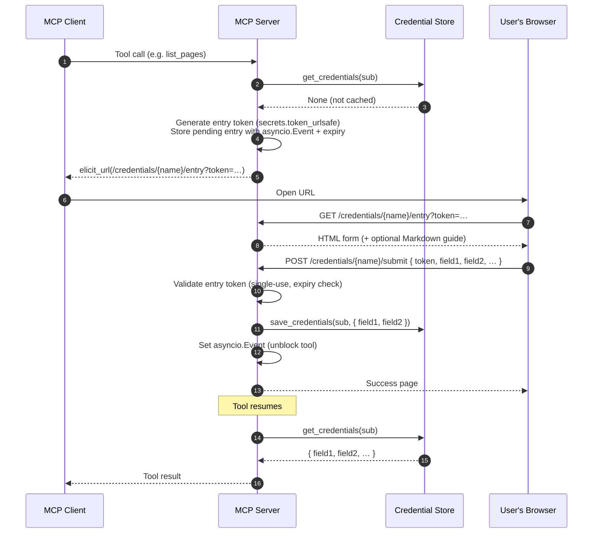
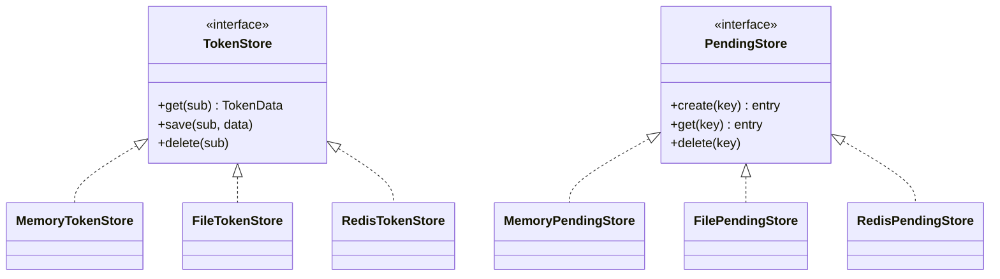
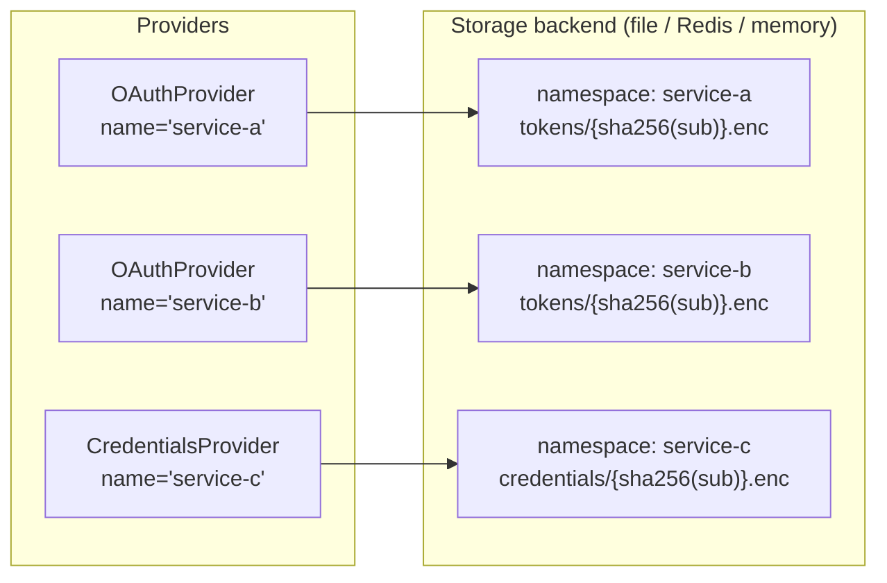
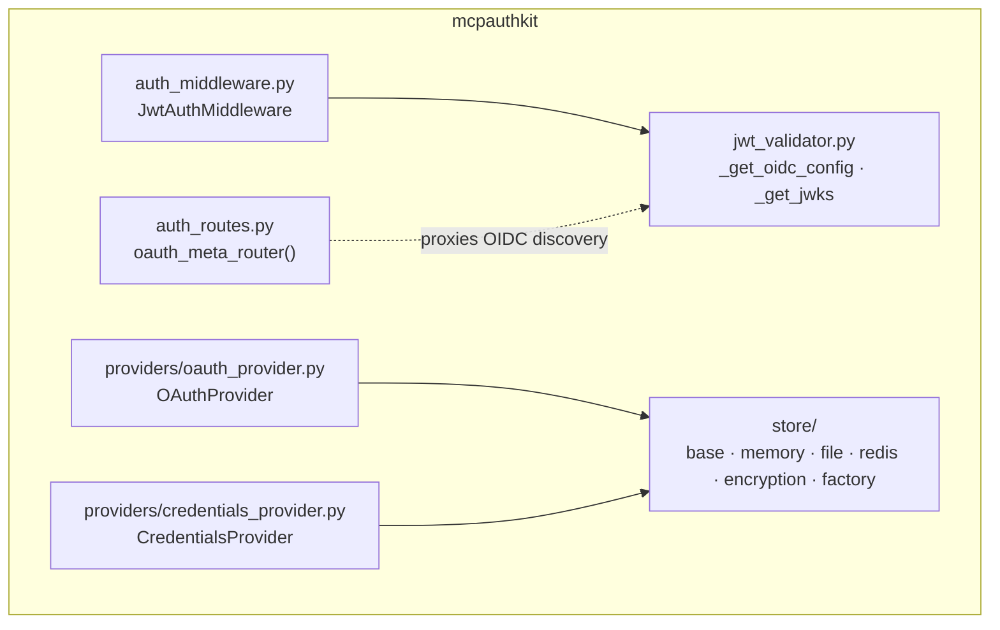

# Architecture

mcp-authkit answers two distinct authentication questions for every MCP tool invocation:

1. **Who is calling?** — every MCP session must carry a valid JWT from a trusted OIDC provider.
2. **Can this tool proceed?** — some tools require a *secondary* credential (an OAuth token from a third-party service, or a PAT/API key) that the primary identity system does not supply.

These are two independent, composable authentication legs that coexist inside the same FastAPI/FastMCP process.

---

## High-level overview



---

## Leg 1 — Session-level OIDC JWT authentication

Every HTTP request must include `Authorization: Bearer <token>`. The token is a JWT issued by the configured OIDC provider and validated locally using the provider's public JWKS.

### MCP client registration

Before the MCP client can authenticate users, it needs to know:

- **Where to send users to log in** — the authorization endpoint
- **Which client to use** — a `client_id` it can use for PKCE

The server exposes the endpoints required by the MCP specification so that clients can discover this information automatically.



**Why a DCR façade?**
The MCP client expects to register dynamically (RFC 7591). In practice, OIDC providers often use a fixed set of pre-registered public clients. The `/register` façade always returns the pre-registered `client_id`, satisfying the protocol without requiring dynamic registration support from the IdP.

**Why proxy the authorization server metadata?**
The MCP spec requires the authorization server metadata to be served at `{server_base_url}/.well-known/oauth-authorization-server`. The real endpoints live at the IdP. The server fetches the IdP's discovery document and re-publishes the real endpoints under its own well-known URL, with `registration_endpoint` pointing to the local façade.

### PKCE authorization flow

Once the client has a `client_id`, it performs a standard PKCE flow directly with the IdP. The server is not involved — it only validates the resulting JWT on subsequent requests.



### JWT validation

The middleware discovers the `jwks_uri` from `{issuer_url}/.well-known/openid-configuration` (cached 10 minutes) and validates signatures against the JWKS (also cached 10 minutes). Supported algorithms: RS256/384/512, PS256/384/512, ES256/384/512, EdDSA.

The validated claims (`sub`, `preferred_username`, `email`, `name`, `iss`, `exp`) are written into a `ContextVar[dict | None]` that you declare once at module level and pass to both the middleware and the providers:

```python
from contextvars import ContextVar
current_user: ContextVar[dict | None] = ContextVar("current_user", default=None)
```

The middleware **writes** it; the Leg 2 providers **read** the `sub` field from it to key per-user token storage. Python's `ContextVar` is scoped per async task automatically, so concurrent requests never interfere. Any tool can also call `current_user.get()` directly — no FastAPI dependency injection needed.

**The server never sees or stores the primary access token** — it only validates signatures.

---

## Leg 2 — Tool-level credential elicitation

Individual tools that need a secondary credential apply a decorator. On first invocation for a given user the decorator checks the credential store; if nothing is cached it triggers the MCP elicitation flow to collect the credential interactively.

### OAuthProvider — Authorization Code + PKCE flow



On subsequent invocations the store lookup returns immediately — no browser interaction.

### CredentialsProvider — PAT / API key form



The entry token is consumed on submit (single-use) and checked against an expiry timestamp, preventing replay attacks.

---

## Request lifecycle

```mermaid
flowchart TD
    req[Incoming HTTP Request]
    cors[CORSMiddleware]
    open{Path in open_paths?}
    bearer{Bearer header present?}
    valid{JWT valid?}
    user[Set current_user ContextVar]
    router[Route to handler]

    req --> cors --> open
    open -- yes --> router
    open -- no --> bearer
    bearer -- no --> E1[401 Unauthorized\nWWW-Authenticate: Bearer ...]
    bearer -- yes --> valid
    valid -- expired --> E2[401 invalid_token]
    valid -- bad signature/claims --> E1
    valid -- ok --> user --> router

    router --> R1[GET /.well-known/*\nPOST /register]
    router --> R2[GET /{name}/callback\nOAuthProvider callback]
    router --> R3[GET /credentials/{name}/entry\nPOST /credentials/{name}/submit]
    router --> R4[GET /health]
    router --> R5[Mount / → FastMCP\nPOST /mcp → MCP protocol]
```

---

## Token & credential store

All token and credential state flows through a common interface (`TokenStore` / `PendingStore`). Three backends are available, selected via the `TOKEN_STORAGE_MODE` environment variable.

### Backend overview



### Variant comparison

| | Memory | File | Redis |
|---|---|---|---|
| **Persistence** | ✗ Lost on restart | ✓ Survives restart | ✓ Survives restart |
| **Multi-worker** | ✗ Per-process dict | ✓ Shared filesystem | ✓ Native |
| **Distributed** | ✗ | ✓ NFS / EFS | ✓ |
| **Encryption** | — | Fernet (AES-128-CBC + HMAC) | Fernet (AES-128-CBC + HMAC) |
| **Best for** | Development / tests | Single-host deployments | Cloud / multi-replica |

### Selecting a backend

Set `TOKEN_STORAGE_MODE` in the environment:

```
TOKEN_STORAGE_MODE=memory   # default — no other config needed
TOKEN_STORAGE_MODE=file     # requires FILE_STORAGE_PATH
TOKEN_STORAGE_MODE=redis    # requires REDIS_URL; pip install mcp-authkit[redis]
```

### Namespace isolation

Every provider passes its `name` as a namespace when creating stores, preventing two providers that happen to share the same user `sub` from colliding.



### Encryption at rest (file + Redis backends)

Every value is encrypted with [Fernet](https://cryptography.io/en/latest/fernet/) (AES-128-CBC + HMAC-SHA256) before writing. The key is resolved at startup:

1. `STORAGE_ENCRYPTION_KEY` env var — base64-encoded Fernet key
2. `STORAGE_ENCRYPTION_KEY_PATH` env var — path to a file containing the key (Docker secrets, Vault agent, AWS Secrets Manager sidecar, …)

If neither is set the server raises `RuntimeError` at startup rather than silently using an ephemeral key.

### Subject hashing

Neither the file store nor the Redis store writes the raw OIDC `sub` to disk or to Redis. Both compute `sha256(sub)` and use the hex digest as the storage key, so a compromised storage layer reveals only opaque hashes and encrypted blobs — no user identifiers.

---

## Component map



- **`auth_middleware.py`** — `BaseHTTPMiddleware` subclass; validates JWT on every non-open path; writes claims into `current_user` ContextVar
- **`auth_routes.py`** — `APIRouter` with `/.well-known/*` and `/register`; must be included *before* the FastMCP mount
- **`jwt_validator.py`** — stateless OIDC/JWKS helpers with 10-minute in-process cache
- **`providers/oauth_provider.py`** — full Authorization Code + PKCE flow; `asyncio.Event`-based callback synchronisation
- **`providers/credentials_provider.py`** — HTML form flow; single-use entry token with expiry
- **`store/`** — pluggable storage with Fernet encryption and `sha256` subject hashing
